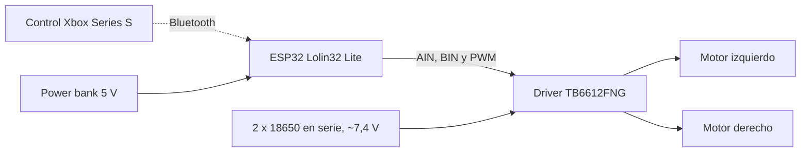

# 🏎️ Carro a control remoto con ESP32

Proyecto final de **Electrónica Análoga II y Básica** — Universidad de Antioquia (UdeA).
Carro de dos ruedas controlado con un **ESP32** y un **control de Xbox Series S** por Bluetooth, para una competencia de carros a control remoto.

---

## 📋 Descripción

El ESP32 genera las señales de dirección y velocidad (PWM) para un driver de motores **TB6612FNG**, que mueve dos motorreductores DC en configuración diferencial (tracción 2WD). El carro avanza, retrocede y gira sobre su propio eje.

