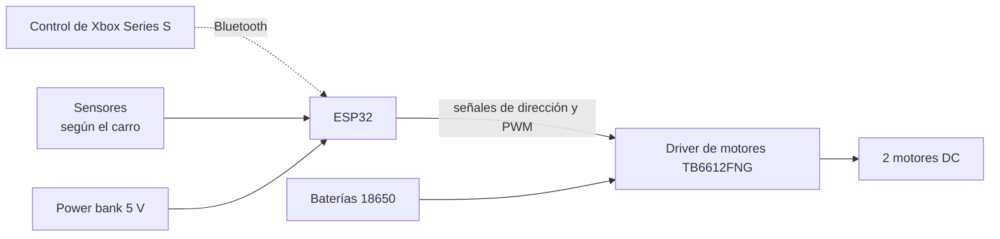

# 🏁 Carros a control remoto: competencia de robótica

Proyecto final de **Electrónica Análoga II y Básica** — Universidad de Antioquia (UdeA).

Diseño y construcción de **dos carros a control remoto** basados en **ESP32**, para participar en las distintas pruebas de una competencia de carros. Cada carro se especializa en un grupo de pruebas.

---

## 🎯 Idea general

En lugar de un solo carro para todo, el proyecto construye **dos carros** que comparten la misma base electrónica, pero con diferencias de hardware y programación según lo que exige cada prueba:

| Carro | Pruebas | Enfoque |
|---|---|---|
| 🚀 **Carro 1: velocidad y sumo** | Velocidad, sumo | Potencia, tracción y robustez |
| 🎯 **Carro 2: obstáculos y seguidor de línea** | Pista con obstáculos, seguidor de línea | Precisión, maniobrabilidad y sensores |

---

## 🏆 Pruebas de la competencia

| Prueba | Carro | Qué se busca |
|---|---|---|
| Velocidad | Carro 1 | Recorrer la pista en el menor tiempo |
| Sumo | Carro 1 | Sacar al oponente del área de combate |
| Pista con obstáculos | Carro 2 | Recorrer la pista esquivando o sorteando obstáculos |
| Seguidor de línea | Carro 2 | Seguir una línea de forma autónoma, sin control remoto |

### Restricciones generales del reglamento

- Dimensiones máximas: **30 × 20 × 15 cm**.
- Peso máximo: **2 kg**.
- El sistema de control y el microcontrolador son libres (RF, Bluetooth, etc.).
- No se pueden arrojar líquidos.

---

## 🧩 Arquitectura general

Los dos carros siguen el mismo esquema:



- **Controlador:** ESP32, con Bluetooth integrado.
- **Control remoto:** control de Xbox Series S, conectado por Bluetooth.
- **Etapa de potencia:** driver de motores TB6612FNG (dos puentes H).
- **Tracción:** dos motorreductores DC en configuración diferencial (2WD).
- **Alimentación:** baterías 18650 para los motores y power bank para el ESP32.

---

## 🔍 Diferencias entre los carros

| Aspecto | Carro 1: velocidad y sumo | Carro 2: obstáculos y línea |
|---|---|---|
| Prioridad | Velocidad y fuerza | Precisión y control |
| Control | Remoto | Remoto (obstáculos) y autónomo (línea) |
| Sensores | Por definir | Sensores infrarrojos para la línea |
| Tracción | Por definir | Por definir |
| Estructura | Por definir | Por definir |

> Los detalles de cada carro se documentan en su propio README.

---

## 🛠️ Tecnologías


- **Lenguaje:** C++ (Arduino).
- **Entorno:** Arduino IDE 2.x con el paquete de placas `esp32`.
- **Control de Xbox:** librería Bluepad32.

---

## 📁 Estructura del repositorio

```text
.
├── README.md                    ← este archivo (visión general)
├── entrega-1/                   ← etapa de potencia y movimiento básico
│   └── README.md
├── carro-velocidad-sumo/        ← Carro 1
│   └── README.md
├── carro-obstaculos-linea/      ← Carro 2
│   └── README.md
└── imagenes/                    ← fotos y diagramas
```

---

## 📚 Documentación

| Documento | Contenido |
|---|---|
| [Entrega 1](entrega-1/README.md) | Puente H y movimiento: adelante, atrás, izquierda y derecha |
| [Carro 1: velocidad y sumo](carro-velocidad-sumo/README.md) | Diseño, conexiones y código del carro 1 |
| [Carro 2: obstáculos y línea](carro-obstaculos-linea/README.md) | Diseño, conexiones y código del carro 2 |

---

## 📅 Estado del proyecto

- [x] **Entrega 1:** etapa de potencia y movimiento básico del carro
- [x] Control de Xbox por Bluetooth
- [ ] **Carro 1:** velocidad y sumo
- [ ] **Carro 2:** obstáculos y seguidor de línea
- [ ] Pruebas y ajustes para la competencia

---

## ⚠️ Seguridad

- Apaga el interruptor antes de sacar o poner las baterías de litio.
- No descargues las celdas 18650 por debajo de 3,0 V ni las dejes cargando sin supervisión.
- Revisa con el multímetro que no haya cortos antes de encender.
- Verifica siempre la polaridad de la batería en el driver de motores.

---

Universidad de Antioquia — Facultad de Ingeniería
