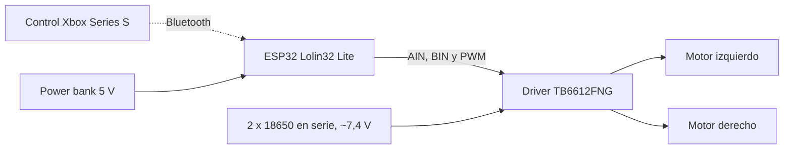

# 🏎️ Carro a control remoto con ESP32

Proyecto final de **Electrónica Análoga II y Básica** — Universidad de Antioquia (UdeA).
Carro de dos ruedas controlado con un **ESP32** y un **control de Xbox Series S** por Bluetooth, para una competencia de carros a control remoto.


> 📸 Agrega aquí una foto o un GIF del carro funcionando.

---

## 📋 Descripción

El ESP32 genera las señales de dirección y velocidad (PWM) para un driver de motores **TB6612FNG**, que mueve dos motorreductores DC en configuración diferencial (tracción 2WD). El carro avanza, retrocede y gira sobre su propio eje.



---

## 🧰 Materiales

| Componente | Cantidad | Nota |
|---|---|---|
| ESP32 Lolin32 Lite | 1 | Controlador principal, con Bluetooth |
| Driver de motores TB6612FNG | 1 | Dos puentes H integrados |
| Chasis 2WD con 2 motorreductores y rueda de apoyo | 1 | Motores tipo TT |
| Baterías 18650 (3,7 V, 2500 mAh) | 2 | En serie con su portapilas: ~7,4 a 8,4 V |
| Power bank 5 V | 1 | Alimenta solo al ESP32 por micro-USB |
| Interruptor | 1 | En el positivo de la batería de los motores |
| Condensadores cerámicos de 100 nF | 2 | Uno entre los terminales de cada motor |
| Condensador electrolítico 470 a 1000 µF | 1 | Entre `VM` y `GND` (recomendado) |
| Protoboard y cables Dupont | — | |
| Control de Xbox Series S | 1 | Mando para manejar el carro |

---

## 🔌 Conexiones

### Alimentación del driver

| Pin TB6612FNG | Se conecta a |
|---|---|
| `VM` | `+` de las baterías (después del interruptor) |
| `VCC` | `3V3` del ESP32 |
| `GND` | `GND` común |
| `STBY` | `3V3` del ESP32 |

> ⚠️ El `GND` del ESP32, el de las baterías y el del driver deben estar unidos.

### Señales

| Pin TB6612FNG | Pin ESP32 | Motor |
|---|---|---|
| `AIN1` | GPIO 16 | Izquierdo |
| `AIN2` | GPIO 17 | Izquierdo |
| `PWMA` | GPIO 22 | Izquierdo |
| `BIN1` | GPIO 18 | Derecho |
| `BIN2` | GPIO 19 | Derecho |
| `PWMB` | GPIO 23 | Derecho |

### Motores

| Pin TB6612FNG | Se conecta a |
|---|---|
| `AO1` / `AO2` | Motor izquierdo (cables rojo y negro) |
| `BO1` / `BO2` | Motor derecho (cables rojo y negro) |

---

## 💻 Código de prueba

Secuencia automática: adelante, atrás, izquierda y derecha.

```cpp
const int AIN1 = 16, AIN2 = 17, PWMA = 22;   // motor izquierdo
const int BIN1 = 18, BIN2 = 19, PWMB = 23;   // motor derecho
const int VEL = 180;                         // velocidad de 0 a 255

void motores(int a1, int a2, int b1, int b2, int v) {
  digitalWrite(AIN1, a1); digitalWrite(AIN2, a2);
  digitalWrite(BIN1, b1); digitalWrite(BIN2, b2);
  analogWrite(PWMA, v);   analogWrite(PWMB, v);
}
void parar()     { motores(LOW, LOW, LOW, LOW, 0); delay(300); }
void adelante()  { motores(HIGH, LOW, HIGH, LOW, VEL); }
void atras()     { motores(LOW, HIGH, LOW, HIGH, VEL); }
void izquierda() { motores(LOW, HIGH, HIGH, LOW, VEL); }
void derecha()   { motores(HIGH, LOW, LOW, HIGH, VEL); }

void setup() {
  int pines[] = {16, 17, 18, 19, 22, 23};
  for (int p : pines) pinMode(p, OUTPUT);
  parar();
}

void loop() {
  adelante();  delay(2000); parar();
  atras();     delay(2000); parar();
  izquierda(); delay(1500); parar();
  derecha();   delay(1500); parar();
  delay(2000);
}
```

---

## 🚀 Cómo cargar el programa

1. Instala **Arduino IDE 2.x** y el paquete de placas **esp32** (Espressif Systems).
2. Elige la placa **WEMOS LOLIN32 Lite** y el puerto COM del ESP32.
3. Con la batería de los motores **apagada**, pulsa **Subir**.
4. Pon el carro con las ruedas en el aire, enciende la batería y verifica el movimiento.

> Para el control de Xbox se usa la librería **Bluepad32**, que requiere el paquete de placas `esp32_bluepad32`.

---

## ✅ Estado del proyecto

- [x] Carro armado sobre el chasis 2WD
- [x] Control de dirección con el driver TB6612FNG
- [x] Movimiento adelante, atrás, izquierda y derecha
- [ ] Control de Xbox por Bluetooth (en pruebas)
- [ ] Mecanismos para las pruebas de la competencia
- [ ] Confirmar con el profesor el uso del módulo como etapa de potencia

---

## ⚠️ Seguridad

- Apaga el interruptor antes de sacar o poner las baterías 18650.
- No descargues cada celda por debajo de 3,0 V y no las dejes cargando sin supervisión.
- Nunca conectes `VM` con la polaridad invertida: el módulo no tiene protección.
- No conectes el ESP32 al PC y al power bank al mismo tiempo.

---

## 👥 Autores

- [Tu nombre y el de tu equipo]

Universidad de Antioquia — Facultad de Ingeniería
