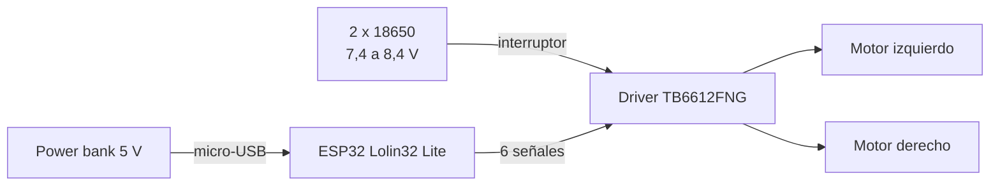

# 🏎️ Entrega 1: etapa de potencia y movimiento del carro

Proyecto final de **Electrónica Análoga II y Básica** — Universidad de Antioquia (UdeA).

En esta primera entrega el carro se mueve **adelante, atrás, a la izquierda y a la derecha** con una secuencia automática programada en un **ESP32**. Todavía no tiene control remoto ni sensores.

---

## 🎯 Objetivo

Implementar la etapa de potencia (puente H) que permite invertir el sentido de giro de dos motores DC y comprobar el movimiento diferencial del carro:

| Movimiento | Motor izquierdo | Motor derecho |
|---|---|---|
| Adelante | ➡️ Adelante | ➡️ Adelante |
| Atrás | ⬅️ Atrás | ⬅️ Atrás |
| Izquierda | ⬅️ Atrás | ➡️ Adelante |
| Derecha | ➡️ Adelante | ⬅️ Atrás |

Al girar, un motor va hacia adelante y el otro hacia atrás, y el carro rota sobre su propio eje.

---

## 🧰 Materiales

| Componente | Cantidad | Función |
|---|---|---|
| ESP32 Lolin32 Lite | 1 | Genera las señales de dirección y velocidad |
| Driver de motores TB6612FNG | 1 | Dos puentes H integrados |
| Chasis 2WD con 2 motorreductores y rueda de apoyo | 1 | Estructura y tracción |
| Baterías 18650 (3,7 V, 2500 mAh) con portapilas | 2 | En serie: ~7,4 a 8,4 V para los motores |
| Power bank 5 V | 1 | Alimenta solo al ESP32 por micro-USB |
| Interruptor | 1 | Enciende y apaga los motores |
| Condensador cerámico de 100 nF | 2 | Uno entre los terminales de cada motor |
| Condensador electrolítico 470 a 1000 µF | 1 | Entre `VM` y `GND` (recomendado) |
| Protoboard y cables Dupont | — | Conexiones |

---

## 🔌 Conexiones

### Alimentación del driver

| Pin TB6612FNG | Se conecta a |
|---|---|
| `VM` | `+` de las baterías (después del interruptor) |
| `VCC` | `3V3` del ESP32 |
| `GND` (ambos) | `GND` común |
| `STBY` | `3V3` del ESP32 |

> ⚠️ El `GND` del ESP32, el de las baterías y el del driver deben estar unidos en el mismo riel.

### Señales desde el ESP32

| Pin TB6612FNG | Pin ESP32 | Función |
|---|---|---|
| `AIN1` | GPIO 16 | Dirección, motor izquierdo |
| `AIN2` | GPIO 17 | Dirección, motor izquierdo |
| `PWMA` | GPIO 22 | Velocidad, motor izquierdo |
| `BIN1` | GPIO 18 | Dirección, motor derecho |
| `BIN2` | GPIO 19 | Dirección, motor derecho |
| `PWMB` | GPIO 23 | Velocidad, motor derecho |

### Motores

| Pin TB6612FNG | Se conecta a |
|---|---|
| `AO1` | Motor izquierdo, cable rojo |
| `AO2` | Motor izquierdo, cable negro |
| `BO1` | Motor derecho, cable rojo |
| `BO2` | Motor derecho, cable negro |

Cada motor lleva un condensador de 100 nF entre sus dos terminales. Si un motor gira al revés de lo esperado, se intercambian sus cables rojo y negro.

### Cómo funciona el driver

| `IN1` | `IN2` | Motor |
|---|---|---|
| Alto | Bajo | Adelante |
| Bajo | Alto | Atrás |
| Bajo | Bajo | Libre |
| Alto | Alto | Frenado |

La velocidad se controla con la señal PWM (0 a 255) de `PWMA` y `PWMB`.

---

## 🚀 Cómo cargar y probar

1. Instala **Arduino IDE 2.x** y el paquete de placas **esp32** (Espressif Systems).
2. Elige la placa **WEMOS LOLIN32 Lite** y el puerto COM del ESP32.
3. Con la batería de los motores **apagada**, carga el código con el botón **Subir**.
4. Revisa con el multímetro que no haya corto entre `VM` y `GND`.
5. Pon el carro con las ruedas en el aire, conecta el power bank, enciende la batería de los motores y comprueba la secuencia.

---

## ✅ Resultados

- [x] El carro avanza
- [x] El carro retrocede
- [x] El carro gira a la izquierda
- [x] El carro gira a la derecha
- [x] Sin cortos en el circuito (verificado con multímetro)

---

## ⚠️ Precauciones

- Apaga el interruptor antes de sacar o poner las baterías 18650.
- No descargues cada celda por debajo de 3,0 V.
- No conectes `VM` con la polaridad invertida: el módulo no tiene protección.
- No conectes el ESP32 al PC y al power bank al mismo tiempo.

---

Universidad de Antioquia — Facultad de Ingeniería
